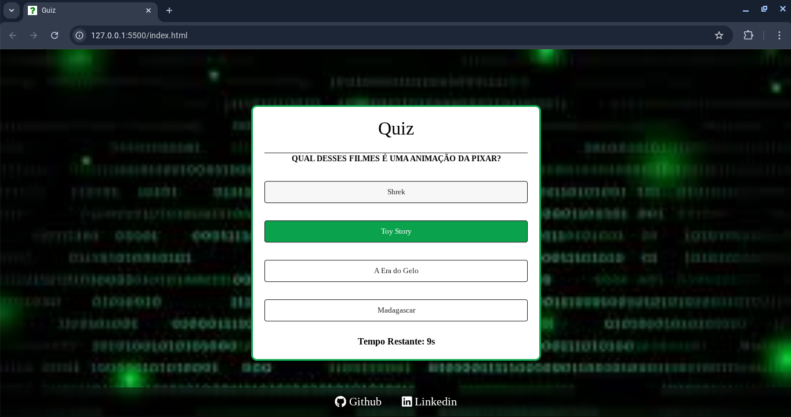
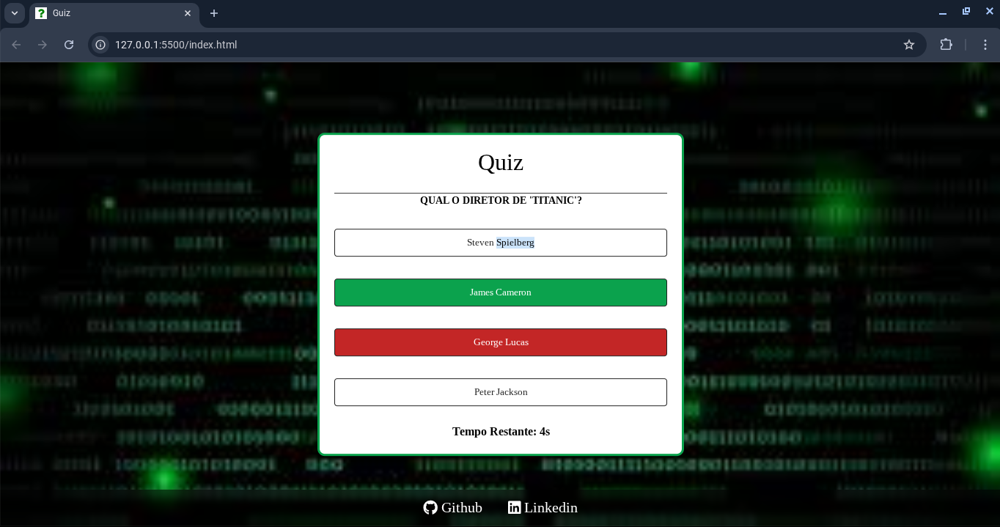

# 🎯 Quiz Interativo com Seleção de Tema

Um quiz interativo feito com HTML, CSS e JavaScript. O usuário informa seu nome, escolhe um tema (como Programação, Cinema, História, etc.) e responde a 7 perguntas sorteadas aleatoriamente. O sistema calcula a pontuação final e o tempo médio de resposta.

👉 Você pode acessar o quiz clicando [aqui](https://gustavo-nog.github.io/GuizQuiz).

---

## 🚀 Funcionalidades

✅ Tela inicial com entrada de nome e seleção de tema  
✅ Perguntas aleatórias (7 por tentativa)  
✅ Contador regressivo de tempo (10s por pergunta)  
✅ Resposta correta/errada com destaque visual  
✅ Cálculo da pontuação final e tempo médio de resposta  
✅ Tela de resultado com feedback personalizado  
✅ Botão para reiniciar o quiz  
✅ Design responsivo para dispositivos móveis

---

## 🎮 Temas Disponíveis

- 💻 Programação  
- 🎬 Cinema  
- 📚 História  
- 🎮 Games  
- 🎵 Música  
- ⚽ Futebol

---

## 📁 Estrutura do Projeto
```bash
/ Guiz  
│
├── index.html # Estrutura da interface
├── style.css # Estilos visuais e responsividade
├── js/
│ └── script.js # Lógica do quiz
│ └── perguntas.js # Banco de dados com as perguntas por tema
├── assets/
│ └── hacker.jpeg # Imagem de fundo
```


---

## 🧠 Tecnologias Utilizadas

- HTML5 📄
- CSS3  🎨
- JavaScript (Vanilla)

---

## 📷 Preview

> (https://gustavo-nog.github.io/GuizQuiz)
>   
>   
>   

---

Autor
Gustavo Alves Nogueira
📧 gustavopan3g7@gmail.com
🔗 [LinkedIn](https://www.linkedin.com/in/gustavo-alves-nogueira)